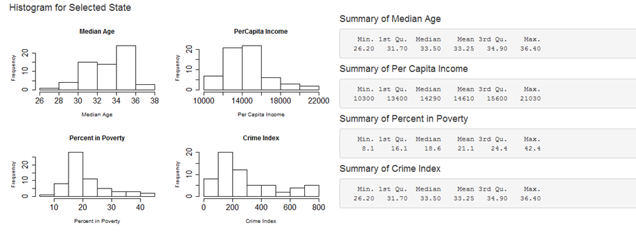

## Overview : Shiny App

- Purpose  : Data exploration, Summary reporting.
- Data set : usa.sensex.csv
- App link : https://suresh-nukala.shinyapps.io/PROJECT/

This project is for underestanding the data in more holistic way by slicing the data into pieces, using visual aids such as histograms, 
calculating the summary of data using different columns.

## Dataset & Input 

Exploratory data analysis: To understand the data in a better way and to summmarize it quickly.
State   : Selection of 'state' for which data need to be plotted.
CheckBox: Selection of 'variable' for which summary to be calculated
Fontsize: Selection of 'fontsize' on plots

## Output

