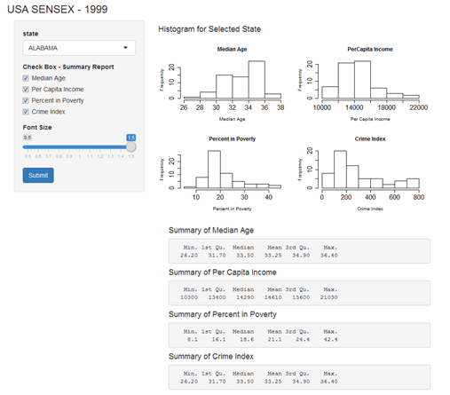
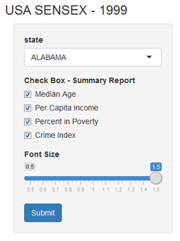
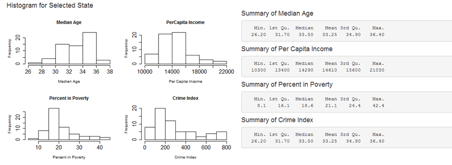

---
title       : USA Sensex Data 
subtitle    : Visualization & Summary
author      : Suresh Nukala
job         : 02/12/2016
framework   : io2012        # {io2012, html5slides, shower, dzslides, ...}
highlighter : highlight.js  # {highlight.js, prettify, highlight}
hitheme     : tomorrow      # 
widgets     : []            # {mathjax, quiz, bootstrap}
mode        : selfcontained # {standalone, draft}
knit        : slidify::knit2slides

--- .class #id 
## Overview of Shiny App

1. Purpose:     Data exploration, Visualization & Report preperation

2. Data Source: usa.sensex.csv

3. App Link:    https://suresh-nukala.shinyapps.io/first_deck/

--- .class #id
## Application of App
1. Main Panel : Data selection by state name
2. Side Panel : Visualization of selected state data density through histogram 
3. Summary    : summary of data such as min, quartile, median, mean, max etc of selected state. 




```r
data <- read.csv("usa.sensex.csv", header = TRUE, sep = ",")
str(data)
```

```
## 'data.frame':	2590 obs. of  7 variables:
##  $ County.Name             : Factor w/ 1501 levels "Abbeville","Acadia",..: 66 71 79 134 178 188 199 237 254 264 ...
##  $ State                   : Factor w/ 48 levels "AL","AR","AZ",..: 1 1 1 1 1 1 1 1 1 1 ...
##  $ Median.Age              : num  31.7 35.5 32.8 34.5 31.7 33.5 32.7 34.8 36.3 34 ...
##  $ PerCapita.Income        : int  15768 16954 15532 14820 11120 12015 15162 13887 13936 14036 ...
##  $ Percent.in.Poverty      : num  15.2 13.6 25 15 33 27.1 18 18.8 15.4 18.6 ...
##  $ Population.Density      : num  60.4 66.5 28.8 62.4 17.6 ...
##  $ Crime.Index..Per.capita.: int  457 282 47 185 141 266 560 218 51 296 ...
```

--- .class #id
## Inputs
1.State: Selection of State

2.Check Box : Selection for Summary Report

3.Font Size : To alter the font size




--- .class #id

## Data Visualization




