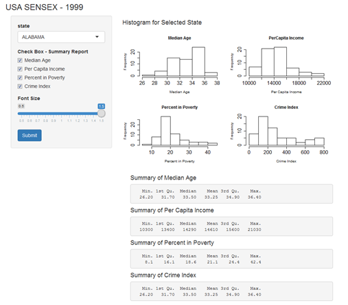
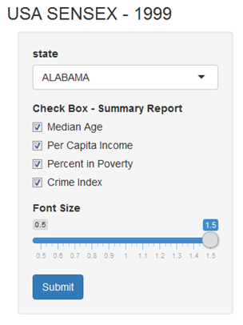

---
title       : USA Sensex Data 
subtitle    : Visualization & Summary
author      : Suresh Nukala
job         : 02/12/2016
framework   : io2012        # {io2012, html5slides, shower, dzslides, ...}
highlighter : highlight.js  # {highlight.js, prettify, highlight}
hitheme     : tomorrow      # 
widgets     : []            # {mathjax, quiz, bootstrap}
mode        : selfcontained # {standalone, draft}
knit        : slidify::knit2slides

--- .class #id 
## Overview of Shiny App

1. Purpose:     Data exploration, Visualization & Report preperation

2. Data Source: usa.sensex.csv

3. App Link:    https://suresh-nukala.shinyapps.io/first_deck/

--- .class #id
## Application of App
1. Main Panel : Data selection by state name
2. Side Panel : Visualization of selected state data density through histogram 
3. Summary    : summary of data such as min, quartile, median, mean, max etc of selected state. 



```{r,fig.width=5, fig.height=4, fig.align='center'}
data <- read.csv("usa.sensex.csv", header = TRUE, sep = ",")
str(data)
```

--- .class #id
## Inputs
1.State: Selection of State

2.Check Box : Selection for Summary Report

3.Font Size : To alter the font size




--- .class #id

## Data Visualization


